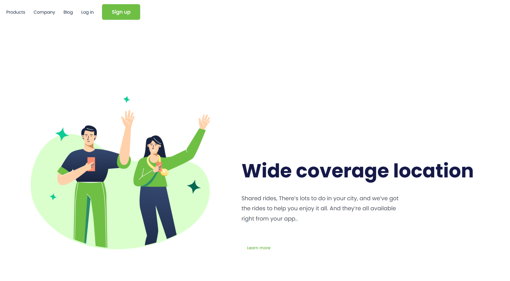
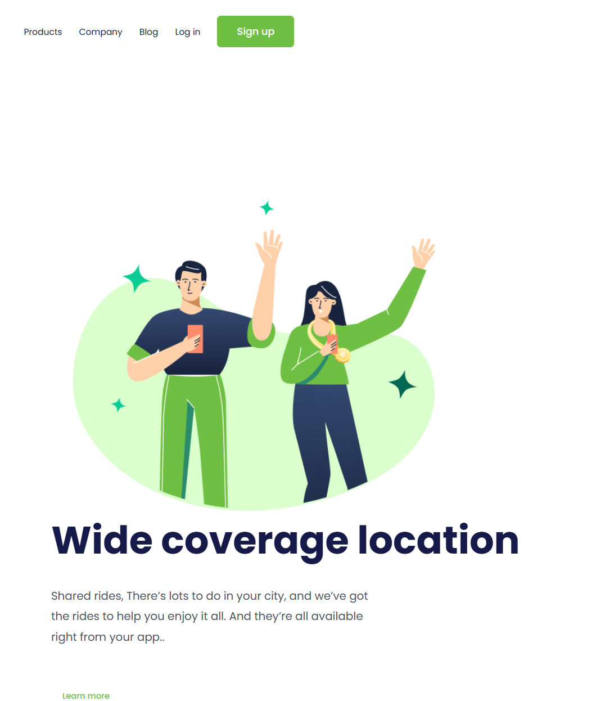

<h1 align="center">Wide Coverage</h1>

<p align="center">
  Landing page responsiva desenvolvida durante meus estudos de HTML e CSS no DevClub.
</p>

<p align="center">
  
</p>

## Sobre o projeto

O **Wide Coverage** é uma landing page responsiva inspirada em uma plataforma de mobilidade e transporte compartilhado.

O projeto foi desenvolvido durante meus estudos no **DevClub**, com o objetivo de praticar a construção de interfaces web utilizando HTML e CSS, além da adaptação do layout para diferentes tamanhos de tela.

## Tecnologias

* HTML5
* CSS3
* Google Fonts
* Poppins
* Media Queries

## O que pratiquei neste projeto

* Estruturação de páginas com HTML
* Utilização de tags semânticas
* Estilização com CSS
* Organização de layouts
* Posicionamento de elementos
* Tipografia com Google Fonts
* Criação e estilização de botões
* Uso de imagens em páginas web
* Construção de menu de navegação
* Responsividade
* Media Queries
* Adaptação do layout para dispositivos móveis

## Preview

### Desktop

<p align="center">
  
</p>

### Responsividade

<p align="center">
  
</p>

## Responsividade

O projeto possui um layout responsivo, adaptando seus elementos para diferentes tamanhos de tela.

Em dispositivos menores, a imagem, os textos, os botões e a navegação são redimensionados e reorganizados para proporcionar uma melhor experiência de visualização.

## Estrutura do projeto

```text id="j98sg2"
wide-coverage/
│
├── img/
│   └── (Positive) Congratulation You get 40 point for your ride.png
├── captura1.png
├── captura2.png
├── index.html
├── style.css
└── README.md
```

## Como executar

Clone o repositório:

```bash id="azfbvt"
git clone https://github.com/lemueltimotio/wide-coverage.git
```

Depois abra o arquivo `index.html` no navegador.

## Projeto online

O projeto também está publicado utilizando o **GitHub Pages**.

Acesse:

```text id="06b85r"
https://lemueltimotio.github.io/wide-coverage/
```

## Autor

Desenvolvido por **Lemuel Juan Dias Timotio** durante meus estudos de desenvolvimento web no DevClub.
